# 2.5 — Google Ads Foundation (Shopify)

**Project:** Kova Studio — Ecommerce
**GTM Container:** Kova Studio (`GTM-NMPNZ4TV`)
**Google Ads Account:** `AW-18244478477` (Kova Studio Ecommerce)
**MCC Account:** `440-830-5844`
**GA4 Measurement ID:** `G-JPWF3JGT5P`
**Published version:** `v2.5.0 - Google Ads Foundation`
**Container export:** `gtm/GTM-NMPNZ4TV_v2.5.0.json`
**Date completed:** 2026-06-19

---

## What This Does & Why

This subproject establishes the baseline Google Ads measurement infrastructure on the Kova Studio Shopify storefront. It covers three foundational tags — Google tag (Config), Conversion Linker, and Dynamic Remarketing — plus the GCLID attribution bridge that makes conversion data readable inside Shopify's sandboxed Custom Pixel environment.

No conversion actions are created here. This subproject's scope is purely infrastructure: the Google tag initialises the Google Ads account on every page, the Conversion Linker captures and persists GCLID attribution, and the Dynamic Remarketing tag fires on all ecommerce events to power audience lists and dynamic product ads. A Custom HTML tag bridges the GCLID from the storefront cookie into Shopify's cart attributes, which is the only reliable mechanism for passing attribution data through Shopify's Custom Pixel sandbox. Conversion actions (Purchase) are deferred to Subproject 2.11, and the GA4 → Google Ads account link is deferred to 2.11 as well — linking before creating the first manual conversion action causes a platform bug that hides the GTM setup option.

---

## Prerequisites

- [ ] GTM container published at `v2.4.x` or later (GA4 Config tag live)
- [ ] Google Ads account `AW-18244478477` created under MCC `440-830-5844`
- [ ] MCC cross-account conversion tracking **disabled** for `AW-18244478477` (see Step 1 below — critical gotcha)
- [ ] `DLV - ecommerce.items` variable exists in GTM (created in 2.4 or earlier)
- [ ] `item_group_id` present in the ecommerce items array in the data layer (added to spec in 2.5 — required for composite remarketing ID)
- [ ] Subproject 2.3 (GTM Foundation) and 2.4 (GA4 Foundation) complete

---

## Business Requirement

Deploy the Google Ads measurement baseline on the Shopify storefront: Google tag firing on all pages, Conversion Linker capturing GCLID attribution with a cart-attributes bridge for the Custom Pixel, and Dynamic Remarketing tag firing on all ecommerce events with correctly formatted product IDs for Google Merchant Center matching.

---

## Data Layer Specification

This subproject does not introduce new `dataLayer.push()` events. The three GTM tags read from existing ecommerce events pushed by earlier subprojects. The Cart Stamp tag (Custom HTML) writes to Shopify's cart attributes via the AJAX API — it does not interact with the `dataLayer`.

### Events consumed by `GAds - Remarketing`

The remarketing tag fires on all standard ecommerce events via regex trigger:

| Event              | Fired by        |
| ------------------ | --------------- |
| `view_item_list`   | Subproject 2.7  |
| `select_item`      | Subproject 2.7  |
| `view_item`        | Subproject 2.6  |
| `add_to_cart`      | Subproject 2.8  |
| `view_cart`        | Subproject 2.9  |
| `remove_from_cart` | Subproject 2.9  |
| `purchase`         | Subproject 2.11 |

### Required item parameter: `item_group_id`

The remarketing tag's composite product ID requires both `item_id` (variant ID) and `item_group_id` (parent product ID) to be present in every items array push. `item_group_id` was added to the data layer spec in this subproject — verify it is present in the Liquid/JS for all ecommerce events before testing the remarketing tag end-to-end.

### GCLID Attribution — Cart Attributes Bridge

Shopify's "Check out" button does not use a standard `<a href>` link. It fires a JavaScript redirect after an AJAX cart submission. The Conversion Linker cannot intercept this, so `_gcl_aw` is never appended to the checkout URL even with URL passthrough enabled.

The Custom Pixel sandbox cannot read first-party cookies from the parent frame, and the `_gcl_aw` cookie is dropped from `fetch()` request headers due to iframe cross-origin policies. This means both the URL and the cookie are inaccessible inside the pixel.

**The fix:** `Custom HTML - GAds GCLID Cart Stamp` fires on `Window Loaded`, reads the `_gcl_aw` cookie written by the Conversion Linker, and writes it to Shopify cart attributes via `/cart/update.js`. Cart attributes survive into checkout and are exposed natively in the Custom Pixel via `event.data.checkout.attributes`.

---

## GTM Setup

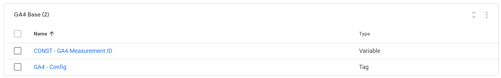

### Critical Pre-Step — MCC Cross-Account Conversion Tracking

Before touching GTM, verify this in Google Ads:

1. Log into MCC `440-830-5844`
2. Go to **Admin → Sub-account settings** → find `AW-18244478477`
3. Check whether **Cross-account conversion tracking** is enabled
4. If enabled → **disable it**
5. Confirm conversion settings are manageable inside `AW-18244478477` directly (settings should not be greyed out)

This burned Phase 1. A new child account defaults to inheriting MCC-level conversion tracking, which prevents the child account from owning its own conversion actions. Must be disabled before creating any conversion actions in 2.11.

### Step 1 — Create `Const - GAds Conversion ID` variable

**Variables → New → Constant**

- **Name:** `Const - GAds Conversion ID`
- **Value:** `AW-18244478477`

### Step 2 — Verify `DLV - ecommerce.items` exists

Check Variables for `DLV - ecommerce.items`. If it does not exist:

**Variables → New → Data Layer Variable**

- **Name:** `DLV - ecommerce.items`
- **Data Layer Variable Name:** `ecommerce.items`
- **Data Layer Version:** Version 2

### Step 3 — Create `DLV - ecommerce.value` variable

**Variables → New → Data Layer Variable**

- **Name:** `DLV - ecommerce.value`
- **Data Layer Variable Name:** `ecommerce.value`
- **Data Layer Version:** Version 2

### Step 4 — Create `CJS - GAds Items Array` variable

**Variables → New → Custom JavaScript**

- **Name:** `CJS - GAds Items Array`

```javascript
function() {
  var items = {{DLV - ecommerce.items}};
  if (!items || !Array.isArray(items)) return [];
  return items.map(function(item) {
    return {
      id: 'shopify_GB_' + item.item_group_id + '_' + item.item_id,
      google_business_vertical: 'retail',
      price: item.price,
      quantity: item.quantity
    };
  });
}
```

**Architecture note:** This variable outputs the final Google Ads format directly (with `id` and `google_business_vertical`), bypassing the community "GA4 Items to GAds Dynamic Remarketing Converter" template. That template hardcodes its data source to the default GA4 ecommerce object and exposes no input field for a custom items array — feeding a modified array into it is not possible. The CJS variable handles the full transformation: rewriting `item_id` to the `shopify_GB_PRODUCTID_VARIANTID` composite format required for Google Merchant Center feed matching.

**Why composite ID:** Shopify's GMC feed uses `shopify_GB_{product_id}_{variant_id}` as the product identifier. The data layer pushes `item_id` = variant ID and `item_group_id` = parent product ID. The CJS variable constructs the composite from both. Without this, remarketing ads cannot match the displayed product to its GMC feed entry.

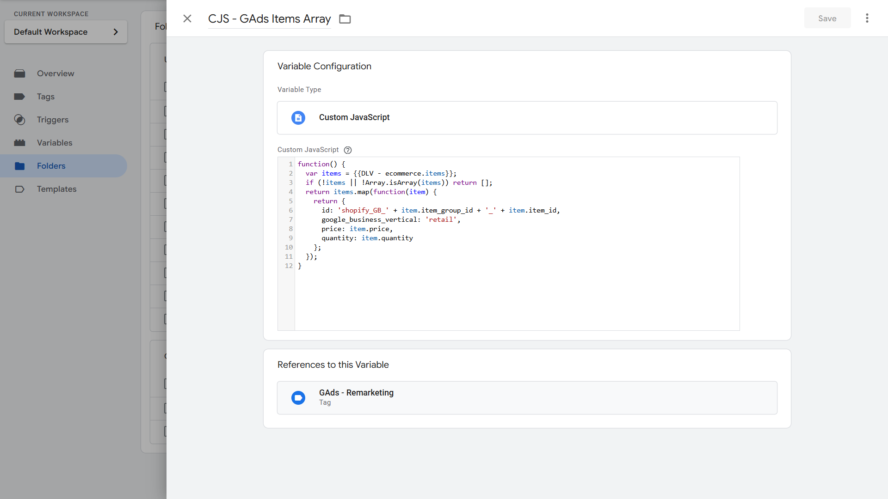

### Step 5 — Create `GAds - Config` tag

**Tags → New → Google tag**

- **Name:** `GAds - Config`
- **Tag ID:** `{{Const - GAds Conversion ID}}`
- **Trigger:** Initialization - All Pages

This fires before all other tags on every page, initialising the `gtag` global and the Google Ads account. Must use Initialization - All Pages (not All Pages / DOM Ready) so it is available before any conversion or remarketing tags fire.

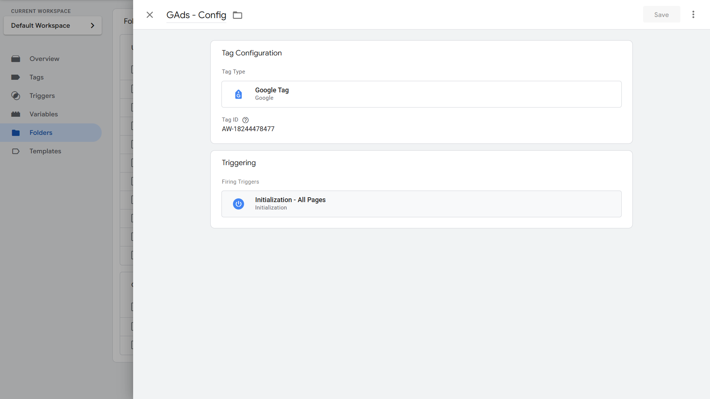

### Step 6 — Create `GAds - Conversion Linker` tag

**Tags → New → Conversion Linker**

- **Name:** `GAds - Conversion Linker`
- **Enable URL passthrough:** ON
- **Cross-domain settings:** leave blank (checkout is on same domain — `fashion-sandbox.myshopify.com/checkouts/...`)
- **Trigger:** All Pages

**Note on URL passthrough:** URL passthrough is enabled but will not append `_gcl_aw` to the checkout URL because Shopify's checkout button uses a JavaScript redirect, not a standard anchor link. The Conversion Linker correctly sets the `_gcl_aw` cookie on the storefront domain. GCLID propagation into the Custom Pixel is handled via the Cart Attributes bridge (Step 8), not URL passthrough.

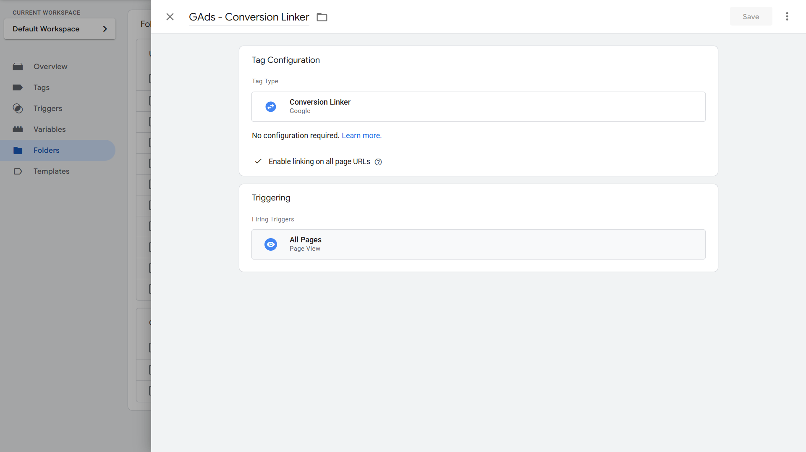

### Step 7 — Create `CE - Ecommerce Events (Remarketing)` trigger

**Triggers → New → Custom Event**

- **Name:** `CE - Ecommerce Events (Remarketing)`
- **Event name:** (regex match)
- **Use regex matching:** ON

```
view_item_list$|select_item$|view_item$|add_to_cart$|view_cart$|remove_from_cart$|purchase$
```

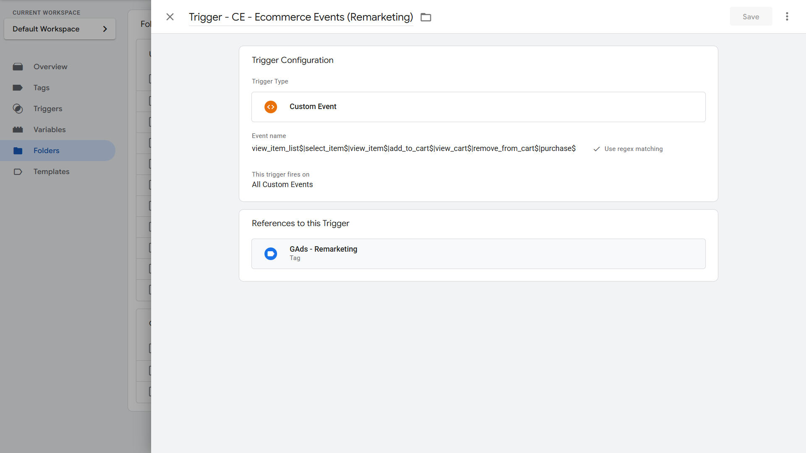

### Step 8 — Create `GAds - Remarketing` tag

**Tags → New → Google Ads Remarketing**

- **Name:** `GAds - Remarketing`
- **Conversion ID:** auto-detected from `GAds - Config` ("Google tag found in this container")
- **Conversion Label:** leave blank
- **Send dynamic remarketing event data:** ON
- **Event Name:** `{{Event}}`
- **Event Value:** `{{DLV - ecommerce.value}}`
- **Event Items:** `{{CJS - GAds Items Array}}`
- **Enable Restricted Data Processing:** False
- **Enable Conversion Linking:** true
- **Trigger:** `CE - Ecommerce Events (Remarketing)`

**Why `{{Event}}` in Event Name:** Google Ads uses the event name to map each tag fire to the correct remarketing list (product viewers, cart abandoners, purchasers). Without it, every remarketing tag fire is indistinguishable to Google Ads regardless of funnel position.

**Why Event Data method (not Community Template):** The "GA4 Items to GAds Dynamic Remarketing Converter" community template hardcodes its data source to the GA4 ecommerce object. It has no input field to accept a custom items array. Feeding a pre-transformed array into it is not possible — it reads `item_id` directly from the data layer (raw variant ID) and would produce incorrect product IDs. The CJS variable + Event Data method is the correct architecture for this use case.

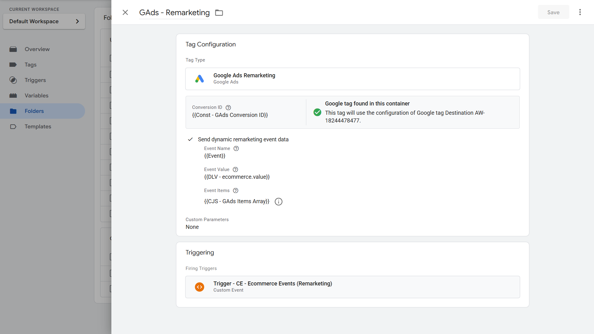

### Step 9 — Create `Custom HTML - GAds GCLID Cart Stamp` tag

**Tags → New → Custom HTML**

- **Name:** `Custom HTML - GAds GCLID Cart Stamp`
- **Trigger:** Window Loaded

```html
<script>
  (function () {
    // Guard: only stamp once per browser session
    if (sessionStorage.getItem("_gcl_aw_stamped")) return;

    // Read _gcl_aw cookie set by Conversion Linker
    var match = document.cookie.match(/_gcl_aw=([^;]+)/);
    if (!match) return;

    var gclAw = match[1];

    // Write to Shopify cart attributes
    fetch("/cart/update.js", {
      method: "POST",
      headers: { "Content-Type": "application/json" },
      body: JSON.stringify({ attributes: { _gcl_aw: gclAw } }),
    })
      .then(function (response) {
        if (response.ok) {
          // Only set guard on confirmed success — retries on next page if API fails
          sessionStorage.setItem("_gcl_aw_stamped", "1");
        }
      })
      .catch(function () {
        // Fail silently — no attribution better than broken page
      });
  })();
</script>
```

**Why Window Loaded (not add_to_cart or view_cart):** Firing on a cart-stage event would miss users who bypass the cart entirely via Buy Now buttons on the product page. Window Loaded fires on every storefront page load, giving the Conversion Linker time to write the `_gcl_aw` cookie first, then immediately stamping cart attributes. The sessionStorage guard ensures at most one API call per session regardless of how many pages are viewed.

**Why the guard only sets on `response.ok`:** If the `/cart/update.js` call fails for any reason, the tag retries on the next page load rather than silently dropping attribution.

**Custom Pixel read:** When the Custom Pixel is built (Subproject 2.16), read the attribute as:

```javascript
var gclAw = (checkout.attributes || []).find(function (a) {
  return a.key === "_gcl_aw";
});
var gclid = gclAw ? gclAw.value : undefined;
```

`checkout.attributes` is an array of `{ key, value }` objects, not a plain key-value map.

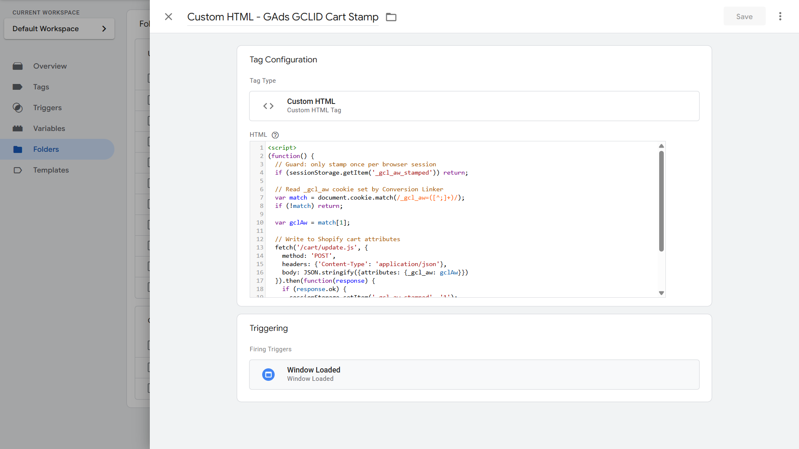

### GTM Version

**Version name:** `v2.5.0 - Google Ads Foundation`
**Version notes:** `Google Ads Config tag, Conversion Linker (URL passthrough ON), Dynamic Remarketing tag with composite shopify_GB product ID format. GCLID cart attributes bridge. GA4 → Google Ads account link deferred to 2.11.`
**Export:** `gtm/GTM-NMPNZ4TV_v2.5.0.json`

---

## GA4 Configuration

No GA4 events or custom dimensions are created in this subproject. The remarketing tag fires independently of GA4.

- **Custom dimensions registered:** None
- **Events marked as conversion:** None (deferred to 2.11)

---

## Google Ads Configuration

No conversion actions are created in this subproject.

**Critical sequencing note for 2.11:** Do NOT link GA4 (`G-JPWF3JGT5P`) to Google Ads (`AW-18244478477`) before creating the manual Purchase conversion action. If GA4 is linked first, the platform may default the conversion source to GA4 and hide the "Use Google Tag Manager" setup option (Conversion ID + Label). The correct sequence in 2.11 is:

1. Create manual conversion action → GTM option visible → copy Conversion ID + Label
2. Build `GAds - Purchase` tag in GTM using those values
3. Link GA4 → Google Ads after the GTM tag is configured

**Attribution model:** Last Click. Google Ads deprecated Linear, Time Decay, Position-based, and First Click attribution models in 2022–2023. Only Data-driven and Last Click are available. This account lacks the historical conversion volume for Data-driven eligibility. Migrate to Data-driven when Google Ads prompts eligibility in the conversion action settings.

---

## Validation Steps

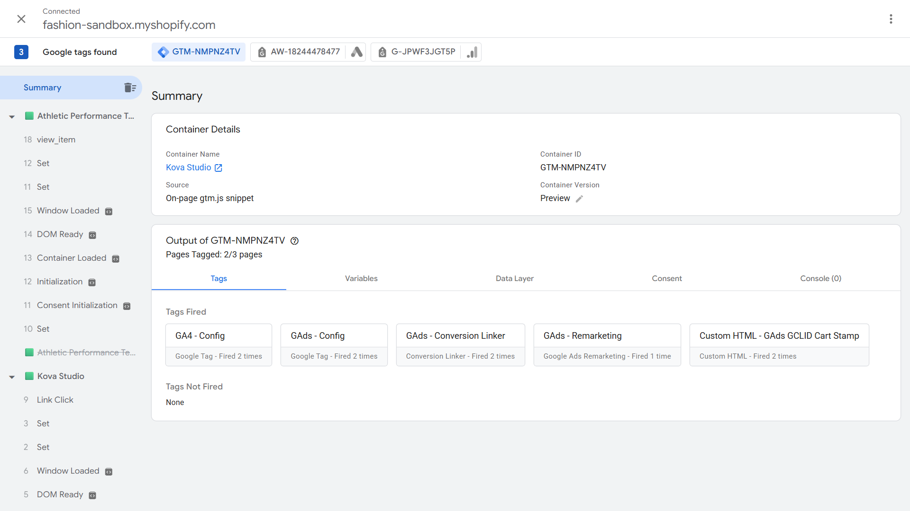

### Baseline tag firing

1. Open GTM Preview → connect to `https://fashion-sandbox.myshopify.com`
2. Navigate any storefront page
3. Click **Initialization** event in the left panel → confirm `GAds - Config` in Tags Fired
4. Click any **Page View** or **DOM Ready** event → confirm `GAds - Conversion Linker` in Tags Fired

### Remarketing tag

5. Open the browser console and push a test event:

```javascript
dataLayer.push({
  event: "view_item",
  ecommerce: {
    value: 50,
    items: [
      {
        item_id: "123",
        item_group_id: "456",
        item_name: "Test Product",
        price: 50,
        quantity: 1,
      },
    ],
  },
});
```

6. In GTM Preview, click the new `view_item` event in the left panel
7. Confirm `GAds - Remarketing` appears in Tags Fired
8. Click into the tag detail → verify Event Items contains `id: 'shopify_GB_456_123'`

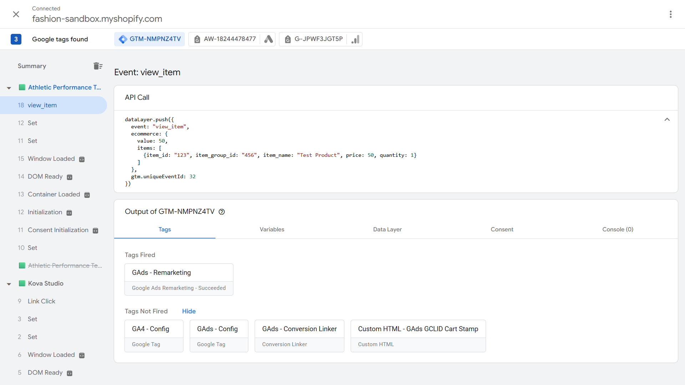
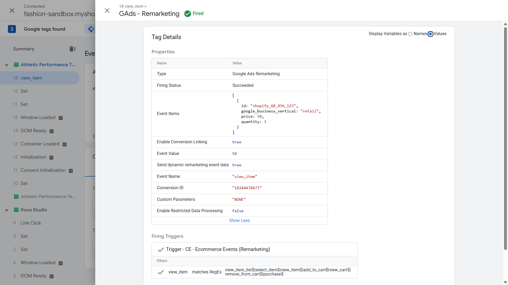

### GCLID cart attributes bridge

9. Navigate to `https://fashion-sandbox.myshopify.com/?gclid=test_gclid_123`
10. Wait for page to fully load (Window Loaded must fire)
11. In GTM Preview → Window Loaded event → confirm `Custom HTML - GAds GCLID Cart Stamp` in Tags Fired
12. Check cookie: **DevTools → Application → Cookies → fashion-sandbox.myshopify.com** → confirm `_gcl_aw` = `GCL.{timestamp}.test_gclid_123`
13. Check cart attribute:

```javascript
fetch("/cart.js")
  .then((r) => r.json())
  .then((d) => console.log(d.attributes));
// Expected: { _gcl_aw: 'GCL.{timestamp}.test_gclid_123' }
```

14. Check sessionStorage guard:

```javascript
sessionStorage.getItem("_gcl_aw_stamped");
// Expected: '1'
```

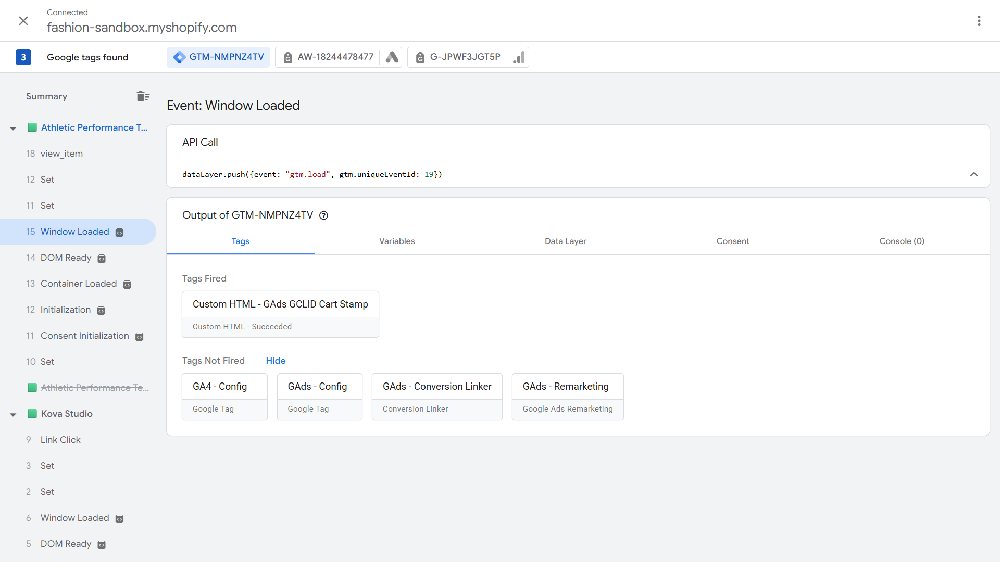

### No-op test (non-Google traffic)

15. Delete the `_gcl_aw` cookie (DevTools → Application → Cookies → delete)
16. Clear sessionStorage: `sessionStorage.clear()`
17. Reload the page
18. Run `fetch('/cart.js').then(r => r.json()).then(d => console.log(d.attributes))` → confirm empty `{}`
19. Confirms the tag is a no-op for organic/direct visitors

---

## QA Checklist

- [ ] `GAds - Config` fires on Initialization - All Pages
- [ ] `GAds - Conversion Linker` fires on All Pages; URL passthrough ON
- [ ] `_gcl_aw` cookie written correctly after landing with `?gclid=` parameter
- [ ] `Custom HTML - GAds GCLID Cart Stamp` fires on Window Loaded
- [ ] Cart attribute `_gcl_aw` written to Shopify cart (confirmed via `/cart.js`)
- [ ] sessionStorage guard `_gcl_aw_stamped` set to `'1'` after successful write
- [ ] Cart Stamp is no-op when `_gcl_aw` cookie absent (non-Google traffic)
- [ ] `GAds - Remarketing` fires on ecommerce events (verified via manual dataLayer push) [🟨 Simulated — ecommerce event subprojects not yet deployed]
- [ ] `CJS - GAds Items Array` outputs `shopify_GB_{item_group_id}_{item_id}` composite format
- [ ] Event Name field passes `{{Event}}` (confirms funnel-stage signal to Google Ads)
- [ ] Event Value field passes `{{DLV - ecommerce.value}}`
- [ ] MCC cross-account conversion tracking disabled for `AW-18244478477`
- [ ] GTM container published as `v2.5.0 - Google Ads Foundation`
- [ ] Container JSON exported to `gtm/GTM-NMPNZ4TV_v2.5.0.json`
- [ ] GA4 → Google Ads link **not** created (deferred to 2.11 — see sequencing note)

---

## Common Errors & Fixes

| Error / Symptom                                                                  | Root Cause                                                                                                        | Fix                                                                                                                                   |
| -------------------------------------------------------------------------------- | ----------------------------------------------------------------------------------------------------------------- | ------------------------------------------------------------------------------------------------------------------------------------- |
| `GAds - Remarketing` not firing on product page visit                            | Ecommerce event subprojects not yet deployed — no `view_item` push in data layer                                  | Expected behaviour at this stage. Test with manual `dataLayer.push()`. Full end-to-end validates in 2.6+                              |
| `CJS - GAds Items Array` returns empty array                                     | `DLV - ecommerce.items` undefined or items array not populated in data layer                                      | Confirm `ecommerce.items` is being pushed before the remarketing event; check DLV name matches exactly                                |
| `item_group_id` missing from composite ID — output is `shopify_GB_undefined_123` | `item_group_id` not present in data layer items push                                                              | Verify Liquid/JS for all ecommerce events includes `item_group_id: {{ product.id \| json }}` per the data layer spec                  |
| `_gcl_aw` cookie set but cart attribute empty                                    | `Custom HTML - GAds GCLID Cart Stamp` fired before `_gcl_aw` cookie was written (race condition)                  | Window Loaded fires after Conversion Linker — race condition unlikely. Check that tag trigger is Window Loaded, not DOM Ready         |
| Cart attribute `_gcl_aw` missing despite correct setup                           | sessionStorage guard is set from a previous session — tag skipped                                                 | Clear sessionStorage (`sessionStorage.clear()`) and reload                                                                            |
| GTM option hidden when creating conversion action in 2.11                        | GA4 linked to Google Ads before conversion action created — platform bug                                          | Unlink GA4, delete the bugged conversion action, hard refresh, re-create conversion action (GTM option now visible), then re-link GA4 |
| Conversion Linker does not append `_gcl_aw` to checkout URL                      | Shopify checkout uses JS redirect (`window.location.assign`), not `<a href>` — Conversion Linker cannot intercept | Expected — this is why the Cart Attributes bridge exists. Not a bug to fix                                                            |
| MCC conversion actions visible in child account but cannot edit                  | Cross-account conversion tracking still enabled at MCC level                                                      | Go to MCC → Admin → Sub-account settings → disable for `AW-18244478477`                                                               |

---

## Reusable Assets

- **GTM Container Export:** `project-ecommerce/gtm/GTM-NMPNZ4TV_v2.5.0.json`
- **CJS variable:** `CJS - GAds Items Array` — reusable for any Shopify store using the `shopify_GB` GMC feed format

---

## Related Guides

- `03-gtm-foundation.md` — GTM container baseline, Shopify theme injection
- `04-ga4-foundation.md` — GA4 Config tag, GA4 account setup
- `02-data-layer-spec.md` — Full ecommerce data layer spec including `item_group_id` and GCLID attribution via cart attributes
- `11-purchase-tracking.md` — Purchase conversion action creation (2.11); GA4 → Google Ads link lives here
- `16-server-side-gtm.md` — sGTM setup; Custom Pixel reads `_gcl_aw` from `checkout.attributes` and includes in fetch() payload
