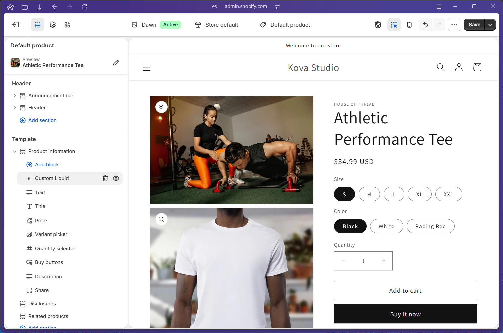
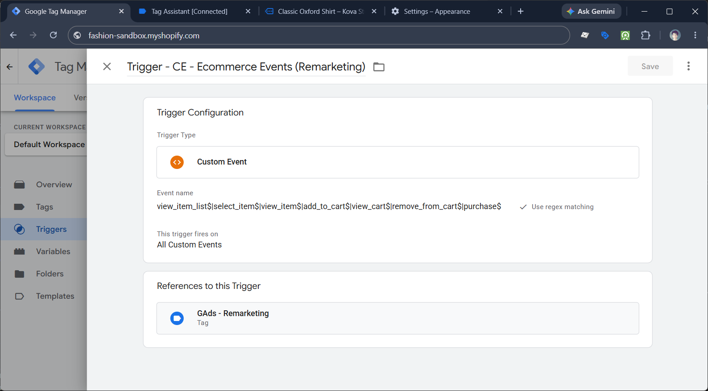
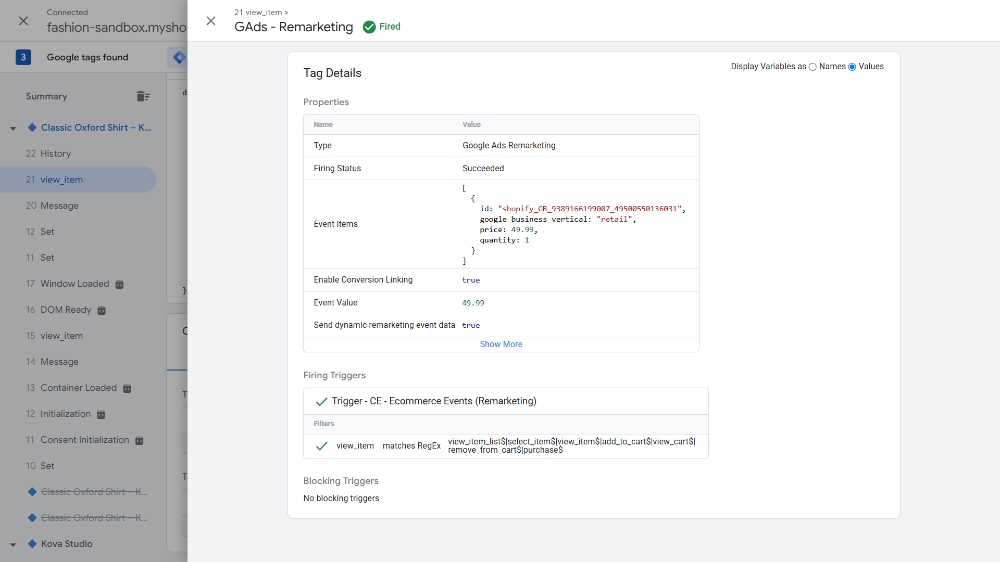
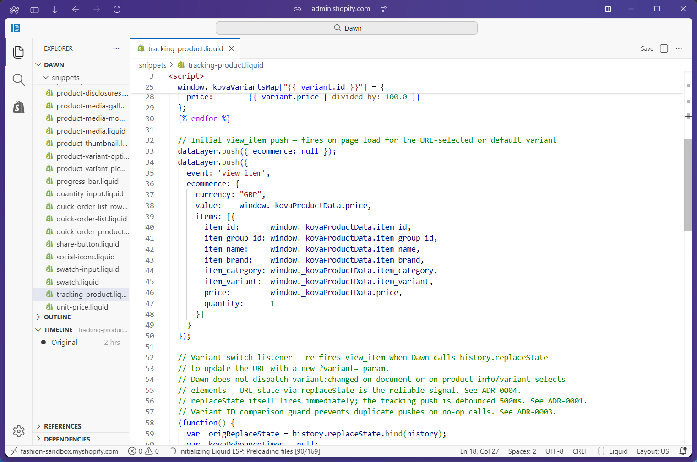
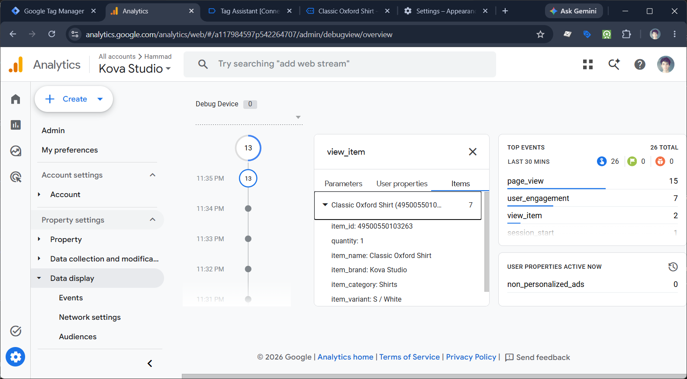

# 2.6 — Product View Tracking (`view_item`)

**Project:** Kova Studio — Ecommerce  
**GTM Container:** Kova Studio (`GTM-NMPNZ4TV`)  
**Google Ads Account:** `AW-18244478477` (Kova Studio Ecommerce)  
**GA4 Measurement ID:** `G-JPWF3JGT5P`  
**GTM version change:** None — no new GTM tags or triggers required  
**Date completed:** 2026-06-24

---

## What This Does & Why

This subproject fires a GA4 `view_item` event every time a customer views a product detail page (PDP) on the Kova Studio storefront, and re-fires it when they switch between variants without reloading the page.

For Google Ads, `view_item` is the signal that drives dynamic remarketing audience membership. When a visitor views a product, the `GAds - Remarketing` tag (deployed in 2.5) fires and passes the exact variant's `shopify_GB_{product_id}_{variant_id}` composite ID to Google Ads. This is what enables Google to serve that specific product — in the exact variant viewed — back to the visitor in a dynamic shopping ad. If `view_item` only fires on page load and the visitor switches variants, Google Ads will remarket the wrong product variant. Re-firing on variant switch keeps the audience signal accurate down to the SKU level.

For GA4, `view_item` populates the product funnel: Shopping Behaviour and Checkout Journey reports depend on `view_item` as the top-of-funnel step before `add_to_cart` and `begin_checkout`. Accurate variant-level data at this stage is also what makes GA4's item-level reports (Items Viewed, Items Viewed to Items Added rate) meaningful.

---

## Prerequisites

- [ ] GTM container published at `v2.5.0` or later (Google Ads foundation live)
- [ ] `GA4 - Ecommerce Events` tag exists with an **All Custom Events** trigger (fires on any `event` key in the dataLayer)
- [ ] `GAds - Remarketing` tag exists with `Trigger - CE - Ecommerce Events (Remarketing)` (regex covers `view_item`)
- [ ] `CJS - GAds Items Array` Custom JavaScript variable exists (builds the GMC composite ID)
- [ ] `DLV - ecommerce.value` and `DLV - ecommerce.items` data layer variables exist
- [ ] Shopify theme is Dawn (the `history.replaceState` variant detection approach is specific to Dawn's URL-update behaviour)
- [ ] Subprojects 2.3 (GTM Foundation), 2.4 (GA4 Foundation), and 2.5 (Google Ads Foundation) complete

---

## Business Requirement

Record which product variant a customer viewed, fire the GA4 `view_item` event with complete item parameters, and update the Google Ads remarketing audience with the exact variant ID — both on initial page load and on every variant switch.

---

## Data Layer Specification

### Event Name

`view_item`

### Event Parameters

| Parameter       | Type    | Example Value            | Notes                                                 |
| --------------- | ------- | ------------------------ | ----------------------------------------------------- |
| `currency`      | string  | `"GBP"`                  | Hardcoded — store currency                            |
| `value`         | number  | `49.99`                  | Price of the currently viewed variant                 |
| `items`         | array   | —                        | Single-element array; see Items Array below           |
| `item_id`       | string  | `"49500550267103"`       | Shopify variant ID — cast to string                   |
| `item_group_id` | number  | `9389166199007`          | Shopify parent product ID — integer from Liquid       |
| `item_name`     | string  | `"Classic Oxford Shirt"` | Product title                                         |
| `item_brand`    | string  | `"Kova Studio"`          | Hardcoded                                             |
| `item_category` | string  | `"Shirts"`               | Shopify Product Type field — set in Admin per product |
| `item_variant`  | string  | `"M / Sky Blue"`         | Variant title (size / colour)                         |
| `price`         | number  | `49.99`                  | Same as `value` — variant unit price                  |
| `quantity`      | integer | `1`                      | Always `1` on view events                             |

**Important:** `item_id` is always a string (cast via `String()` in the Liquid snippet). `item_group_id` is an integer (output directly from Liquid). GTM's `CJS - GAds Items Array` variable handles the string concatenation for the GMC composite ID.

### Full dataLayer Code

#### Initial push (page load)



```liquid
 snippets/tracking-product.liquid 
 2.6 — view_item + replaceState variant listener. add_to_cart added in 2.8. 
<script>
  window.dataLayer = window.dataLayer || [];

  

  // Page-level product data store.
  // Defined here (view_item), consumed by the replaceState listener below
  // and by the add_to_cart intercept (2.8). See ADR-0002.
  window._kovaProductData = {
    item_id:       String({{ current_variant.id | json }}),
    item_group_id: {{ product.id | json }},
    item_name:     {{ product.title | json }},
    item_brand:    "Kova Studio",
    item_category: {{ product.type | json }},
    item_variant:  {{ current_variant.title | json }},
    price:         {{ current_variant.price | divided_by: 100.0 }}
  };

  // Pre-rendered lookup map of all variants — used by the replaceState listener
  // to retrieve full variant data without an AJAX call.
  window._kovaVariantsMap = {};
  
  window._kovaVariantsMap["{{ variant.id }}"] = {
    item_id:      "{{ variant.id }}",
    item_variant: {{ variant.title | json }},
    price:        {{ variant.price | divided_by: 100.0 }}
  };
  

  // Initial view_item push — fires on page load for the URL-selected or default variant
  dataLayer.push({ ecommerce: null });
  dataLayer.push({
    event: 'view_item',
    ecommerce: {
      currency: "GBP",
      value:    window._kovaProductData.price,
      items: [{
        item_id:       window._kovaProductData.item_id,
        item_group_id: window._kovaProductData.item_group_id,
        item_name:     window._kovaProductData.item_name,
        item_brand:    window._kovaProductData.item_brand,
        item_category: window._kovaProductData.item_category,
        item_variant:  window._kovaProductData.item_variant,
        price:         window._kovaProductData.price,
        quantity:      1
      }]
    }
  });

  // Variant switch listener — re-fires view_item when Dawn calls history.replaceState
  // to update the URL with a new ?variant= param.
  // Dawn does not dispatch variant:changed on document or on product-info/variant-selects
  // elements — URL state via replaceState is the reliable signal. See ADR-0004.
  // replaceState itself fires immediately; the tracking push is debounced 500ms. See ADR-0001.
  // Variant ID comparison guard prevents duplicate pushes on no-op calls. See ADR-0003.
  (function() {
    var _origReplaceState = history.replaceState.bind(history);
    var _kovaDebounceTimer = null;

    history.replaceState = function(state, title, url) {
      _origReplaceState(state, title, url); // always update URL immediately

      if (typeof url !== 'string') return;
      var match = url.match(/[?&]variant=(\d+)/);
      if (!match) return;

      var newId = match[1];

      clearTimeout(_kovaDebounceTimer);
      _kovaDebounceTimer = setTimeout(function() {
        // Guard: skip no-op calls. Cast both to string. See ADR-0003.
        if (newId === String(window._kovaProductData.item_id)) return;

        var variantData = window._kovaVariantsMap[newId];
        if (!variantData) return;

        // Update shared data store
        window._kovaProductData.item_id      = newId;
        window._kovaProductData.price        = variantData.price;
        window._kovaProductData.item_variant = variantData.item_variant;

        dataLayer.push({ ecommerce: null });
        dataLayer.push({
          event: 'view_item',
          ecommerce: {
            currency: "GBP",
            value:    window._kovaProductData.price,
            items: [{
              item_id:       window._kovaProductData.item_id,
              item_group_id: window._kovaProductData.item_group_id,
              item_name:     window._kovaProductData.item_name,
              item_brand:    window._kovaProductData.item_brand,
              item_category: window._kovaProductData.item_category,
              item_variant:  window._kovaProductData.item_variant,
              price:         window._kovaProductData.price,
              quantity:      1
            }]
          }
        });
      }, 500);
    };
  })();
</script>
```

**Key design decisions in this snippet:**

- **`product.selected_or_first_available_variant`** — Resolves to the variant in the URL (`?variant=123`) if present; otherwise the first available variant. Ensures page load push always matches what the customer is viewing.
- **`window._kovaProductData`** — Global object defined in the `view_item` block. Mutable fields (`item_id`, `price`, `item_variant`) are updated on each genuine variant switch. Static fields (`item_group_id`, `item_name`, `item_brand`, `item_category`) never change. The `add_to_cart` intercept (2.8) reads this object — do not redefine it in 2.8. See `docs/adr/0002-window-kova-product-data-in-view-item-snippet.md`.
- **`window._kovaVariantsMap`** — Pre-rendered at page load from all product variants. Eliminates the need for an AJAX call when a variant switches. Keys are variant IDs as strings.
- **Price format** — Liquid's `divided_by: 100.0` outputs decimal (e.g. `49.99`), not cents. Do **not** add `/ 100` in the JavaScript listener — prices in `_kovaVariantsMap` are already decimal.
- **`String()` on `item_id`** — Liquid outputs variant IDs as integers. The `String()` wrapper ensures consistent string type for the variant ID comparison guard.

---

## GTM Setup

### No new GTM configuration required for this subproject

Both existing tags already handle `view_item` automatically:

- **`GA4 - Ecommerce Events`** fires on an **All Custom Events** trigger — picks up any `event` key pushed to the dataLayer, including `view_item`.
- **`GAds - Remarketing`** fires on `Trigger - CE - Ecommerce Events (Remarketing)`, which uses the regex `view_item_list$|select_item$|view_item$|add_to_cart$|view_cart$|remove_from_cart$|purchase$`. `view_item` is already in the regex.





**GTM version:** No new publish required for 2.6. Container remains at `v2.5.0`.

### Existing tag reference

**`GAds - Remarketing`**

- Tag type: Google Ads Remarketing
- Conversion ID: `{{Const - GAds Conversion ID}}` (resolves to `18244478477`)
- Send dynamic remarketing event data: ✅
- Event Name: `{{Event}}`
- Event Value: `{{DLV - ecommerce.value}}`
- Event Items: `{{CJS - GAds Items Array}}`

`CJS - GAds Items Array` constructs the GMC composite ID from `item_group_id` and `item_id`:

```javascript
// shopify_GB_{item_group_id}_{item_id}
// e.g. shopify_GB_9389166199007_49500550267103
```

---

## Shopify Theme Setup

### Step-by-step

**Step 1 — Create the snippet file**

In Shopify Admin → Online Store → Themes → **Edit code** → `snippets/` folder → **Add a new snippet** → name it `tracking-product` → paste the full snippet above → Save.



**Step 2 — Inject via Custom Liquid block**

Go to Shopify Admin → Online Store → Themes → **Customize** → switch the template dropdown to **Products → Default product**.

In the left sidebar, under the **Product information** section: click **Add block** → choose **Custom Liquid** → paste:

```

```

Drag the Custom Liquid block to the **top** of the Product information block list — it must render and execute before any user interaction (variant picker, add to cart button).

Click **Save**.

**Why Custom Liquid blocks (not section file edits):** Blocks are stored in the template's JSON config, not in core `.liquid` section files. Theme updates do not overwrite them. The only recovery task after a theme update is re-adding `` if the block is lost.

**What to avoid:**

- ❌ Editing `sections/main-product.liquid` directly — overwritten on theme update
- ❌ Adding the `<script>` tag to `theme.liquid` — fires on every page, not just PDPs; `product` object is not available outside product templates

---

## GA4 Configuration



- **Event name:** `view_item`
- **Marked as conversion:** No
- **Custom dimensions registered:** None — `item_id`, `item_group_id`, `item_name`, `item_category`, `item_variant` are all native GA4 ecommerce parameters; no registration required

---

## Google Ads Configuration

This subproject does not create a conversion action. `view_item` feeds the **dynamic remarketing audience** — visitors who viewed a specific product variant are added to the audience list and served dynamic ads showing that exact product.

- **Conversion action:** None (remarketing only at this stage)
- **Remarketing tag:** `GAds - Remarketing` (deployed in 2.5)
- **Audience source:** Google Ads tag (via the Remarketing tag)
- **Dynamic feed matching:** `shopify_GB_{item_group_id}_{item_id}` must match the GMC product feed ID exactly

---

## Validation Steps

[Screenshot: GTM Preview event list showing view_item at page load]

1. Open GTM Preview (GTM → your container → Preview) → connect to `https://fashion-sandbox.myshopify.com`
2. Navigate to any product page with multiple variants
3. Confirm `view_item` appears in the GTM Preview event list
4. Click the `view_item` event → Tags tab → confirm `GA4 - Ecommerce Events` and `GAds - Remarketing` both show **Fired**
5. Click `GAds - Remarketing` → confirm Event Items shows:
   - `id: "shopify_GB_{product_id}_{variant_id}"` (composite format, GB country code)
   - `google_business_vertical: "retail"`
   - `price:` a decimal number (not cents)
   - `quantity: 1`
6. In the browser console, confirm `window._kovaProductData` is populated:
   ```javascript
   console.log(JSON.stringify(window._kovaProductData, null, 2));
   ```
7. Confirm `window._kovaVariantsMap` contains all variant IDs:
   ```javascript
   console.log(Object.keys(window._kovaVariantsMap));
   ```

[Screenshot: GTM Preview showing second view_item event after variant switch, with new item_id and item_variant]

8. Click a different variant swatch — wait 500ms
9. Confirm a second `view_item` event appears in GTM Preview
10. Confirm `item_id` and `item_variant` reflect the newly selected variant
11. In the browser console after the switch:
    ```javascript
    console.log(JSON.stringify(window._kovaProductData, null, 2));
    // item_id and item_variant should reflect the switched variant
    ```

[Screenshot: GA4 DebugView showing view_item event]

12. Open GA4 → Admin → DebugView — confirm `view_item` appears with correct parameters

---

## QA Checklist

- [ ] `view_item` fires on product page load
- [ ] `view_item` does **not** fire on non-product pages (collection, cart, home)
- [ ] `view_item` fires with the URL variant (`?variant=123`) when a variant param is present in the URL, not always the default variant
- [ ] `view_item` re-fires after variant switch (wait 500ms after clicking a swatch)
- [ ] `view_item` does **not** double-fire when clicking the already-selected variant swatch
- [ ] `item_id` is a string in the dataLayer push (wrapped in quotes, not a bare integer)
- [ ] `item_group_id` is the parent product ID (different from `item_id` which is the variant ID)
- [ ] `item_category` is populated (not empty/undefined) — requires Product Type to be set per product in Shopify Admin
- [ ] `price` is a decimal float (e.g. `49.99`), not cents (e.g. `4999`)
- [ ] `quantity` is `1` on all view_item pushes
- [ ] `window._kovaProductData` updates after variant switch (verify via console)
- [ ] `window._kovaProductData.item_id` reflects the currently visible variant after all switches
- [ ] `GA4 - Ecommerce Events` tag fires on `view_item` (GTM Preview → Tags tab)
- [ ] `GAds - Remarketing` tag fires on `view_item` (GTM Preview → Tags tab)
- [ ] Remarketing Event Items `id` uses `shopify_GB_` prefix with correct product and variant IDs
- [ ] `ecommerce: null` push precedes every `view_item` push (GTM Preview → Data Layer tab — no parameter bleed from prior events)
- [ ] `tracking-product.liquid` snippet exists in Shopify theme `snippets/` folder
- [ ] Custom Liquid block (``) is in the Default Product template
- [ ] Custom Liquid block is positioned at the **top** of the Product information section

---

## Common Errors & Fixes

| Error / Symptom                                                      | Root Cause                                                                                   | Fix                                                                                                                                         |
| -------------------------------------------------------------------- | -------------------------------------------------------------------------------------------- | ------------------------------------------------------------------------------------------------------------------------------------------- |
| `view_item` doesn't fire at all                                      | `tracking-product.liquid` not uploaded to live theme (only added locally)                    | Go to Shopify Admin → Online Store → Themes → Edit Code → snippets → confirm file exists; paste content if missing                          |
| `window._kovaProductData` is `undefined`                             | Snippet not running — file missing from live theme or Custom Liquid block not saved          | See above                                                                                                                                   |
| `view_item` fires on page load but not on variant switch             | `history.replaceState` patch not running, or running after GTM's patch with a chaining error | Check browser console for JS errors; confirm the IIFE wrapping `history.replaceState` runs without errors                                   |
| Variant switch fires immediately without debounce (duplicate events) | Debounce timer variable conflict — another script overwrites `_kovaDebounceTimer`            | Timer is stored as `window._kovaDebounceTimer` (prefixed); check for naming collisions                                                      |
| `item_id` is wrong variant on switch                                 | Variant ID comparison guard not working — IDs not cast to strings                            | Verify both sides of the guard are wrapped in `String()`: `String(newId) === String(window._kovaProductData.item_id)`                       |
| `item_category` is empty or undefined                                | Product Type not set in Shopify Admin for that product                                       | Go to Shopify Admin → Products → [product] → set Product type (e.g. `"Shirts"`)                                                             |
| `price` is `0` or `undefined` after variant switch                   | `_kovaVariantsMap` key not found for the new variant ID                                      | Confirm Liquid loop rendered all variants: `console.log(window._kovaVariantsMap)` — if key is missing, check the Liquid loop in the snippet |
| Remarketing `id` is `shopify_GB_undefined_undefined`                 | `item_group_id` or `item_id` not in dataLayer                                                | Check `CJS - GAds Items Array` variable — verify it reads from `ecommerce.items[0].item_group_id` and `ecommerce.items[0].item_id`          |
| `price` is a large integer (e.g. `4999`) instead of `49.99`          | Liquid `divided_by: 100.0` filter removed or missing                                         | Re-add `\| divided_by: 100.0` to all price Liquid assignments in the snippet                                                                |
| `view_item` fires but GA4 tag does not                               | `GA4 - Ecommerce Events` trigger is not All Custom Events                                    | In GTM → Tags → GA4 - Ecommerce Events → check trigger; should fire on All Custom Events                                                    |
| Double `view_item` on page load                                      | Dawn fires `history.replaceState` during initialization with the same variant ID             | Variant ID comparison guard handles this: if incoming ID matches `_kovaProductData.item_id`, the push is skipped                            |

---

## Architectural Decisions

Four ADRs were recorded during the design of this subproject. See `docs/adr/` for full context.

| ADR                                                     | Decision                                                                                                                                                                                                     |
| ------------------------------------------------------- | ------------------------------------------------------------------------------------------------------------------------------------------------------------------------------------------------------------ |
| `0001-view-item-refires-on-variant-switch.md`           | `view_item` re-fires on variant switch (not page load only) — required for accurate dynamic remarketing at SKU level                                                                                         |
| `0002-window-kova-product-data-in-view-item-snippet.md` | `window._kovaProductData` is defined in the `view_item` block, not the `add_to_cart` block — enables the variant switch listener and provides the shared data store for 2.8                                  |
| `0003-variant-id-comparison-guard.md`                   | Variant ID comparison guard used instead of a boolean flag — immune to execution-order race conditions; both IDs cast to string                                                                              |
| `0004-variant-switch-detection-via-replacestate.md`     | `history.replaceState` interception used instead of `variant:changed` event — Dawn does not dispatch `variant:changed` on `document`, `product-info`, or `variant-selects`; URL state is the reliable signal |

---

## Reusable Assets

- **Snippet file:** `theme_export__fashion-sandbox-myshopify-com-dawn__24JUN2026-1042am/snippets/tracking-product.liquid`
- **ADRs:** `project-ecommerce/docs/adr/0001` through `0004`
- **Domain glossary:** `project-ecommerce/CONTEXT.md`

---

## Related Guides

- `project-ecommerce/docs/02-data-layer-spec.md` — full items array schema and universal rules
- `project-ecommerce/docs/05-google-ads-foundation.md` — GAds tags and CJS - GAds Items Array variable that this guide depends on
- `project-ecommerce/docs/08-add-to-cart-tracking.md` — 2.8 completes `tracking-product.liquid` by adding the `/cart/add.js` intercept; reads `window._kovaProductData` defined here
